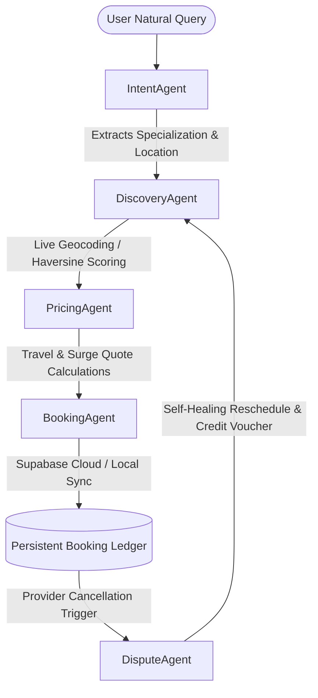

# Hamara-Rozgar (RozgarOrch) 🛠️
### Challenge 2: AI Service Orchestrator for Informal Economy - Google Antigravity Hackathon

**Hamara-Rozgar (RozgarOrch)** is a premium, agentic, AI-driven marketplace orchestrator designed to solve fragmentation in Pakistan's informal economy. By bridging the digital divide for daily wage workers (plumbers, electricians, tutors, AC technicians, beauticians, mechanics), this solution automates the end-to-end booking lifecycle. It parses multi-turn conversational queries across Urdu, Roman Urdu, and English, executes proximity matching, performs travel-adjusted pricing, registers persistent transactions, and resolves real-time anomalies.

The project is **100% Evacuated from Google Cloud**, running fully offline and using open-source/self-hosted equivalents (OSM, Supabase, Ollama, Groq, GitHub Models) inside a beautiful **Widescreen Native Web Dashboard** featuring a **Chronological Agentic Execution Timeline**.

---

## 🏛️ System Architecture

Our solution is built on a **Decoupled Multi-Agent Cooperative Pipeline**. Rather than a monolithic model, tasks are delegated to specialized micro-agents that communicate parameters sequentially and react dynamically to operational state updates:



### The 5 Cooperative micro-agents:
1. **IntentAgent (Multilingual Parsing & Context Memory)**:
   * Extracts target specialization and location parameters across English, formal Urdu script, and colloquial Roman Urdu slang (e.g., *"yar AC kaam nahi kr rha thanda"*).
   * Fully integrates multiple selectable LLM parsing engines:
     - **Local Slang Parser (Regex)**: Ultra-fast offline dictionary fallback.
     - **Ollama**: Private, self-hosted offline LLM intent parsing.
     - **Groq Cloud API**: Free-tier Open LLM intent parsing.
     - **GitHub Models API**: High-fidelity intent parsing.
     - **Auto-Failover**: If Groq API fails or is rate-limited, it automatically fails over to the GitHub Models API (if configured) before resorting to regex.
   * Maintains multi-turn context memory across conversation history.

2. **DiscoveryAgent (Proximity & Workload Optimizer)**:
   * Connects directly to browser GPS Geolocation coordinates on startup.
   * If a custom location or landmark is specified, it queries the **OpenStreetMap Nominatim API** (free & open-source) to geocode precise coordinates.
   * Scores and ranks matching specialists using a **6-Factor Utility Function**:
     $$\text{Utility} = (d \times 0.25) + (R \times 0.20) + (L \times 0.20) + (P \times 0.15) + (C \times 0.10) + (S \times 0.10)$$
     *(Where $d$ = distance, $R$ = rating, $L$ = reliability score, $P$ = price match, $C$ = cancellation rate, $S$ = sector matching).*
   * Queries nearby physical listings dynamically using OpenStreetMap Nominatim search indexes.

3. **PricingAgent (Dynamic Cost Generator)**:
   * Formulates transparent billing invoices consisting of:
     * **Base Rate:** The standard benchmark service fee.
     * **Travel Allowance:** Multiplied dynamically by coordinate distance (50 PKR/km).
     * **Urgency Surcharge:** +30% weight for immediately requested task cards.
     * **Surge Surplus:** +15% dynamic surcharge if active provider capacity is constrained.
     * **Loyalty Discount:** -10% deduction automatically applied to retain repeat clients.

4. **BookingAgent (Persistent Transaction Ledger)**:
   * Syncs active transaction records with **Supabase Cloud Database** via a lightweight direct REST API (sub-250KB footprint, zero bulky SDKs).
   * Incorporates an offline fallback to browser local storage (`localStorage`) in case database connections are pending, ensuring uninterrupted user interactions.

5. **DisputeAgent (Self-Healing Fallback Engine)**:
   * Intercepts post-booking real-time anomalies (such as a provider cancelling en-route).
   * Automatically launches a new discovery query, re-assigns the job card to the next-best provider, issues an automated 150 PKR voucher credit to the customer, and updates the transaction status in Supabase.

---

## 🔌 API Integrations & Payload Schemas

### 1. OpenStreetMap Nominatim Geocoding API
Converts human sector and colony names to precise geocodes:
* **Endpoint:** `GET https://nominatim.openstreetmap.org/search?q={LocationName},Islamabad,Pakistan&format=json&limit=1`
* **Response Output:** Extracts `lat`/`lon` dynamically.

### 2. GitHub Models API (High-Fidelity NLP)
Standard OpenAI-compatible completions endpoint:
* **Endpoint:** `POST https://models.inference.ai.azure.com/chat/completions`
* **Headers:** Pass standard token `Authorization: Bearer <githubToken>`.

### 3. Supabase Database REST API
Synchronizes transactional statuses across client states:
* **Endpoint:** `POST {supabaseUrl}/rest/v1/bookings`
* **Headers:** Pass `apikey: <supabaseKey>` and `Authorization: Bearer <supabaseKey>`.
* **Database Schema (PostgreSQL):**
```sql
create table bookings (
  id text primary key,
  provider_id text not null,
  provider_name text not null,
  provider_phone text,
  service text not null,
  location text not null,
  time_slot text not null,
  pricing jsonb not null,
  status text not null,
  timestamp text not null,
  location_coords jsonb
);
```

---

## 🌟 Premium Design Aesthetics

The interface is built completely on **Vanilla CSS** (zero external bloated styling dependencies) optimized for widescreen workspaces:
* **Widescreen Native Workspace Layout:** Grid-based multi-panel structure (`340px 1fr 440px`) utilizing modern glassmorphic panels and Harmonious synthwave tech styling.
* **Chronological Agentic Timeline Tree:** Displays active stages (Intent Parsing, Geocoding, Registry Scan, Dynamic Pricing, Ledger Booking, Real-time Tracking). Node states animate dynamically (in-progress, completed, failed, pending) with expandable accordion drawers exposing **Agent Thoughts, Reasoning, and Tool Logs**.
* **Proximity Location Hub Bar:** Real-time indicator displaying the current GPS coordinate lock vs manual landmark overrides.
* **Transaction Ledger Viewer:** Full-screen dashboard table grid displaying histories and active status sync badges directly connected to Supabase.

---

## 📦 Mobile App Compilation (Capacitor)

The project includes a pre-configured native wrapper directory (`android/`) scaffolding standard Gradle environments. 

To compile this web application into a native standalone **Android APK** without needing manual Android Studio setup, run our executable scripts in the root directory:
* **Linux/macOS:** Run `./build_apk.sh` in your terminal.
* **Windows:** Double-click the file `build_apk.bat`.

The compiler will automatically bundle React, synchronize native Capacitor resources, and execute Gradle to generate the standalone installer package at:
`android/app/build/outputs/apk/release/app-release-unsigned.apk`

---

## 🚀 Installation & Local Run

1. Navigate to the project root and install all node packages:
   ```bash
   cd service-orchestrator
   npm install
   ```
2. Start the local Vite server:
   ```bash
   npm run dev
   ```
3. Open `http://localhost:5173` in your browser.
4. **Demo Flow:**
   * Enter your Supabase URL and Anon Key in the left Credentials card to see the badge transition to green (`Supabase Connected`).
   * Select your preferred intent parser engine (Regex, Ollama, Groq, or GitHub Models).
   * Submit a slang query (e.g. *"yaar AC bilkul thanda nhi kar rha G-13 me"*).
   * Watch the Timeline nodes activate, geocoding coordinates on OpenStreetMap, ranking candidates, and committing the booking to your remote Supabase cloud table.
